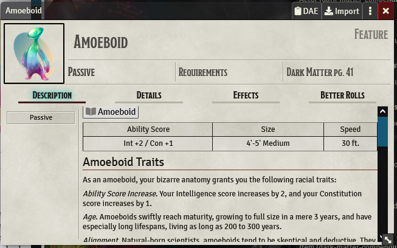
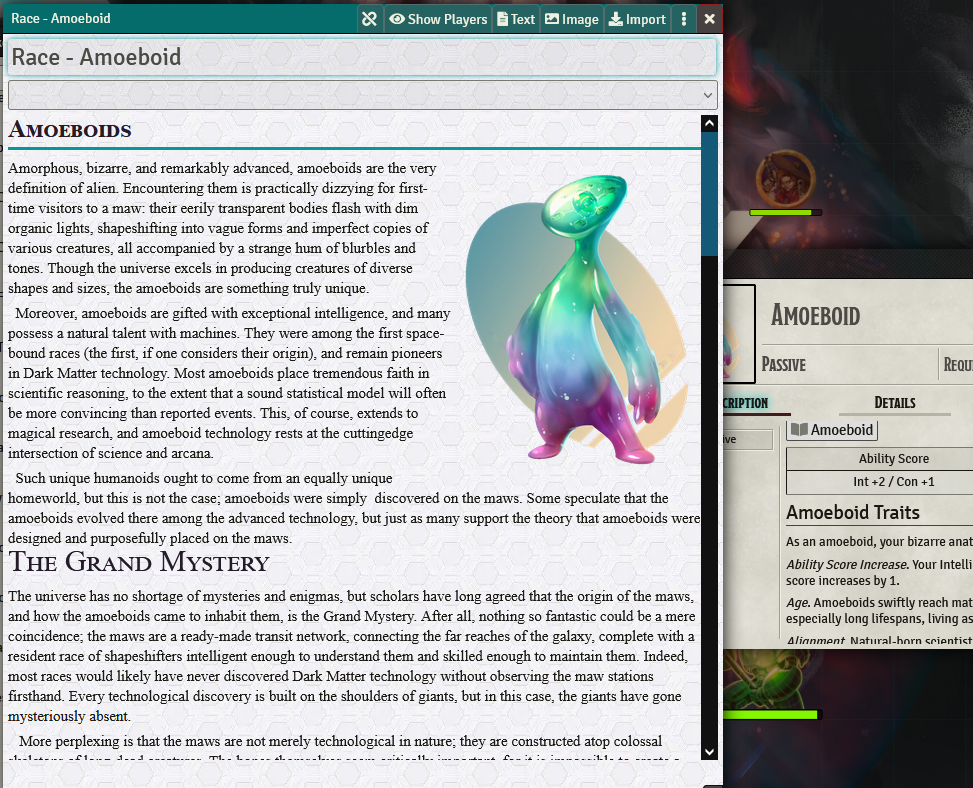
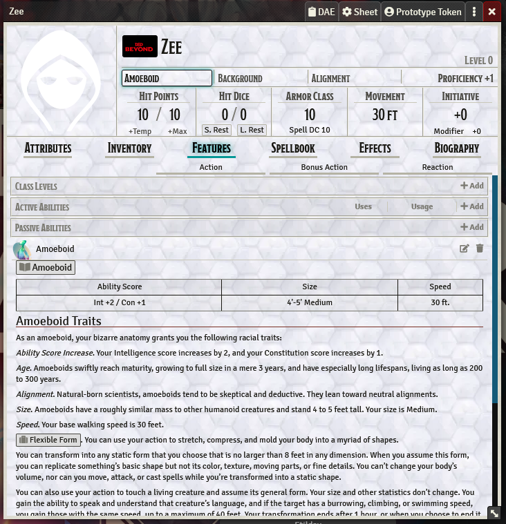

 

### (Note Re: Foundry v10)
As of v1.x, dark-matter-compendiums has been relabeled as "Dark Matter: Core" to reflect that this addon is strictly what comes out of the Dark Matter Core Rulebook (v1.41 as of this writing), AND this addon as of v1 is designed for Foundry v10 and MAY not work with v8/v9. The LAST build for v8/v9 will be kept for those not ready to upgrade, but you really should get v10 at some point, especially if you DO NOT have an active game in progress.

# Dark Matter: Core
An add-on module of the [Dark Matter Core Rulebook](https://darkmatter.magehandpress.com/), created by [Mage Hand Press](https://store.magehandpress.com/) for use with the [Foundry Virtual Table Top](https://foundryvtt.com/) system.

## Installation
1. From within Foundry VTT Configuration and Setup Screen, select the Add-on Modules option.
2. Click on Install Module, and see the _Dependencies_ section below.
3. Copy the link for the Manafest URL (https://gitlab.com/dark-matter1/dark-matter-compendium/raw/master/module.json) into the same field at the bottom of the window.
4. Create a game world or open an existing world and enable the module under Game Settings > Manage Modules.

## Dependencies
This module uses some other extensions to run properly.

* [Dark Matter System Extensions](https://github.com/lorenjerickson/dark-matter-extensions) adds Dark Matter specific skills, weapon properties and more on top of the [Foundry VTT dnd5e Game System](https://gitlab.com/foundrynet/dnd5e).
* [Journal Anchor Links](https://foundryvtt.com/packages/jal) lets you link to a header (h1-h6) in a journal page. Makes it easy to have scene notes that open to a place in a journal entry.
* [Compendium Folders](https://github.com/earlSt1/vtt-compendium-folders) adds subfolders to the Compendiums menu. Makes it easier to search through all the system compendiums, but is NOT required to run.

## Getting Started
The main compendium entries are divided into categories like Race, Class, and Equipment. If you have [Compendium Folders](https://github.com/earlSt1/vtt-compendium-folders) module enabled they should all be in one folder called Dark Matter. If not you'll find them under Items or JournalEntry.

Most entries have links to other compendium entries that may simply be imported into your game world, or you may wish to drag and drop them into character sheets or (like in the case with Monsters), right into the active scene. For example, if you want to create an Amoeboid race player, start by opening the Dark Matter Races (Items) compendium and click on Amoeboid:

From here you can click on links within the Amoeboid entry to see other compendium entries like the text from the core Dark Matter book:

You can also drag the Amoeboid Race (Item) onto a blank Player Character sheet in Foundry to add the Amoeboid race stats to a new character.

_(Notice how some of the Character Sheet fields fill in automatically?)_

# Special Thanks
- To [Mage Hand Press](https://mfov.magehandpress.com/) and the Digits of Vecna over on the [MHP Discord](https://discord.gg/pJEWa6b) for the amazing setting that is the Dark Matter 'Verse. (and for not shutting us down at first wind.)
- [@CSMcFarland#6471](https://gitlab.com/csmcfarland) for hosting @ gitlab, coding the heck out of the ['Verse](https://github/com/lorenjerickson/dark-matter-extensions), and teaching Git to those eager to learn, but pretty clueless.
- [@Android8675#9424](https://gitlab.com/Android8675) who can't write anything here because it would be weird to talk about himself in the third person, but he's thankful that he's able to contribute so much.
- [@OwlbearAviary#9251](https://github.com/RabidOwlbear/) for the added html, javascript code foo and all the pretty colors.

## Notice:
We are currently looking for people to help on this project. If you think you'd like to help (even if you don't know anything about development or coding, etc), please feel free to reach out to one of the people mentioned here in Discord at the [Mage Hand Press Server](https://discord.gg/pJEWa6b). 

Making Foundry Modules is a great way to understand how Foundry VTT works, and how you can tame it's sometimes wild nature to do what you want it to do. I highly encourage at least joining the [Foundry VTT Discord Server](https://discord.gg/foundryvtt) and doing a little research on module development. If you'd like to Contribute, [here's where you can get started](CONTRIBUTING.md).
